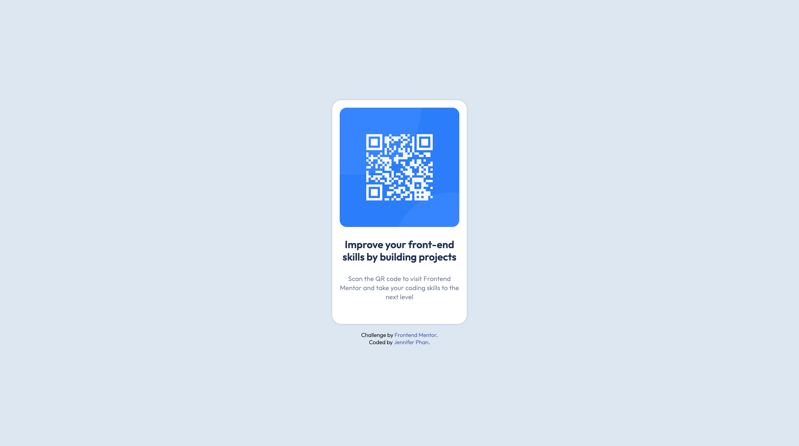

# Frontend Mentor - QR code component solution

This is a solution to the [QR code component challenge on Frontend Mentor](https://www.frontendmentor.io/challenges/qr-code-component-iux_sIO_H). Frontend Mentor challenges help you improve your coding skills by building realistic projects. 

## Table of contents

- [Overview](#overview)
  - [Screenshot](#screenshot)
  - [Links](#links)
- [My process](#my-process)
  - [Built with](#built-with)
  - [What I learned](#what-i-learned)
  - [Continued development](#continued-development)
- [Author](#author)

## Overview

### Screenshot



### Links

- Solution URL: [Solution](https://www.frontendmentor.io/solutions/qr-code-component-using-css-custom-properties-and-flexbox-shf7qjFi11)
- Live Site URL: [Live site](https://jenphan.github.io/QR-Code-Component/)

## My process

### Built with

- Semantic HTML5 markup
- CSS custom properties (variables)
- Flexbox for layout
- Mobile-first design approach
- Google Fonts (Outfit)

### What I learned

This project allowed me to focus on the small yet import aspects of front-end development, such as:
- Organizing and naming CSS custom properties
- Creating a responsive and centered layout with a minimal amount of code
- Using systemized spacing and consistent naming conventions

Here is a segment of the CSS variable structure I implemented:

```css
:root {
    --clr-bg: #dde7f2;
    --clr-card: #ffffff;
    --clr-title: #1f314f;
    --clr-text: #68778d;
    --clr-link: hsl(228, 45%, 44%);
    --ff-base: 'Outfit', sans-serif;
}
```

### Continued development

In future projects, I plan to:
- Focus on implementing the best accessibility practices
- Practice better implementations from Figma or design styles

## Author

- GitHub - [@jenphan](https://github.com/jenphan)
- Frontend Mentor - [@jenphan](https://www.frontendmentor.io/profile/jenphan)
